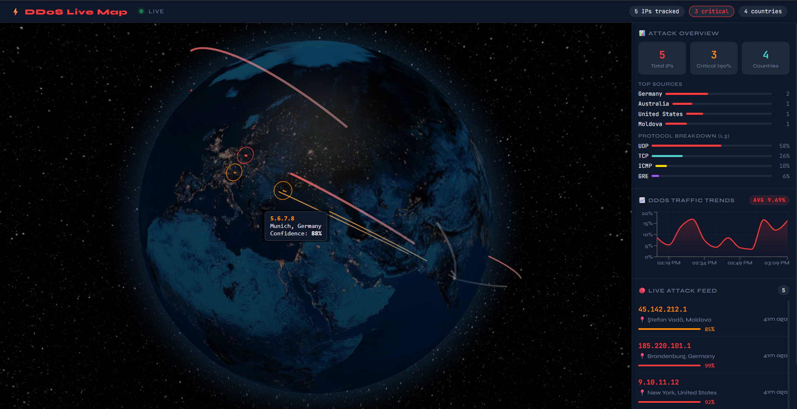

#  Live DDoS Attack Map

> Real-time global DDoS attack visualization powered by AbuseIPDB, Cloudflare Radar, WebSockets, and a 3D interactive globe.



---

##  Overview

**Live DDoS Attack Map** is a full-stack cybersecurity dashboard that tracks, classifies, and visualizes DDoS attacks in real time across a 3D rotating globe. Attackers are geolocated from their IPs, scored by confidence, and rendered as animated arcs flying toward a target server - all streamed live via WebSockets.

This project demonstrates end-to-end data engineering: API ingestion → geolocation → real-time streaming → interactive visualization.

---

##  Features

-  **3D Rotating Globe** - attack arcs animated in real time using `globe.gl` (Three.js)
-  **Live Attack Feed** - scrolling list of attacker IPs, cities, countries, and confidence scores
-  **DDoS Traffic Trends** - area chart showing attack percentage over time from Cloudflare Radar
-  **IP Confidence Scoring** - AbuseIPDB confidence score (≥80%) used to classify and color-code threats
-  **IP → Geo Resolution** - real-time IP geolocation via ip-api.com (lat/lon, city, country, ISP)
-  **WebSocket Streaming** - new attack arcs pushed to frontend instantly, no polling
-  **Auto-reconnect** - frontend WebSocket auto-reconnects on drop with exponential backoff
-  **Mock Data Fallback** - works fully without API keys for development and demo
-  **Protocol Breakdown** - Cloudflare L3 attack protocol split (UDP / TCP / ICMP / GRE)

---

##  Architecture

```
┌─────────────────────────────────────────────────────────────┐
│                        DATA SOURCES                          │
│                                                             │
│   AbuseIPDB API          Cloudflare Radar API               │
│   (Blacklisted IPs)      (Traffic Trends + L3 Stats)        │
└──────────┬──────────────────────────┬───────────────────────┘
           │                          │
           ▼                          ▼
┌─────────────────────────────────────────────────────────────┐
│                     FASTAPI BACKEND                          │
│                                                             │
│  ┌─────────────┐   ┌──────────────┐   ┌─────────────────┐  │
│  │ abuseipdb   │   │  cloudflare  │   │    scheduler    │  │
│  │  .py        │   │    .py       │   │      .py        │  │
│  │             │   │              │   │  (polls every   │  │
│  │ fetch IPs   │   │ fetch trends │   │   60 seconds)   │  │
│  │ filter ≥80% │   │ L3 summary   │   │                 │  │
│  └──────┬──────┘   └──────┬───────┘   └────────┬────────┘  │
│         │                 │                     │           │
│         ▼                 ▼                     │           │
│  ┌─────────────┐   ┌──────────────┐             │           │
│  │  ip-api.com │   │   REST API   │             │           │
│  │  geolocation│   │  /api/trends │             │           │
│  │  IP → lat/  │   │  /http       │             │           │
│  │  lon/city   │   │  /layer3     │             │           │
│  └──────┬──────┘   └──────────────┘             │           │
│         │                                        │           │
│         ▼                                        ▼           │
│  ┌─────────────────────────────────────────────────────┐    │
│  │                    store.py                          │    │
│  │           In-memory arc store (deque maxlen=200)     │    │
│  │           IP deduplication via seen_ips set          │    │
│  └───────────────────────┬─────────────────────────────┘    │
│                          │                                    │
│                          ▼                                    │
│  ┌────────────────────────────────────────────────────┐     │
│  │              websocket_manager.py                   │     │
│  │         Broadcast new arcs to all clients           │     │
│  │              WebSocket /ws endpoint                 │     │
│  └───────────────────────┬────────────────────────────┘     │
└──────────────────────────┼─────────────────────────────────-┘
                           │ WebSocket
                           ▼
┌─────────────────────────────────────────────────────────────┐
│                    REACT FRONTEND                            │
│                                                             │
│  ┌──────────────┐  ┌─────────────┐  ┌──────────────────┐   │
│  │  GlobeView   │  │ AttackFeed  │  │   TrendChart     │   │
│  │  (globe.gl)  │  │ (live list) │  │   (Recharts)     │   │
│  │              │  │             │  │                  │   │
│  │  3D rotating │  │ IP, city,   │  │  Attack % over   │   │
│  │  earth with  │  │ country,    │  │  time area chart │   │
│  │  attack arcs │  │ confidence  │  │                  │   │
│  └──────────────┘  └─────────────┘  └──────────────────┘   │
│                                                             │
│  ┌──────────────────────────────────────────────────────┐   │
│  │                   StatsBar                           │   │
│  │    Total IPs | Critical ≥90% | Countries             │   │
│  │    Top Sources | Protocol Breakdown (L3)             │   │
│  └──────────────────────────────────────────────────────┘   │
│                                                             │
│  ┌──────────────────┐    ┌─────────────────────────────┐    │
│  │  useWebSocket.js │    │       useTrends.js           │    │
│  │  WS connection + │    │  Polls /api/trends every     │    │
│  │  auto-reconnect  │    │  5 minutes                   │    │
│  └──────────────────┘    └─────────────────────────────┘    │
└─────────────────────────────────────────────────────────────┘
```

---

## 📁 Project Structure

```
Live-DDoS-Attack-Map/
│
├── backend/                          # FastAPI Python backend
│   ├── main.py                       # App entry point, CORS, router registration, lifespan
│   ├── config.py                     # Pydantic settings (API keys, thresholds, intervals)
│   │
│   ├── models/
│   │   ├── __init__.py
│   │   └── schemas.py                # Pydantic models: AttackEvent, AttackArc, TrendSummary, etc.
│   │
│   ├── routers/
│   │   ├── __init__.py
│   │   ├── attacks.py                # GET /api/attacks/arcs, /stats, POST /refresh
│   │   ├── trends.py                 # GET /api/trends/http, /layer3
│   │   └── websocket.py              # WebSocket /ws — init state + real-time push
│   │
│   ├── services/
│   │   ├── __init__.py
│   │   ├── abuseipdb.py              # Fetch blacklisted IPs, filter by confidence, batch geolocate
│   │   ├── cloudflare.py             # Fetch HTTP trends + L3 protocol breakdown
│   │   ├── store.py                  # In-memory arc store, deduplication, stats computation
│   │   ├── scheduler.py              # Background asyncio task — polls AbuseIPDB every 60s
│   │   └── websocket_manager.py      # WS connection pool, broadcast to all clients
│   │
│   ├── .env                          # API keys (gitignored)
│   └── .env.example                  # Template for environment variables
│
├── frontend/                         # React + Vite frontend
│   ├── index.html                    # HTML entry point
│   ├── vite.config.js                # Vite configuration
│   ├── package.json                  # Dependencies: globe.gl, recharts, react
│   │
│   └── src/
│       ├── main.jsx                  # React root render
│       ├── App.jsx                   # Main layout: globe + sidebar
│       ├── index.css                 # Global dark theme styles
│       │
│       ├── components/
│       │   ├── GlobeView.jsx         # globe.gl 3D earth, arc rendering, ring pulses, auto-rotate
│       │   ├── AttackFeed.jsx        # Live scrolling feed of attacker IPs + confidence bars
│       │   ├── TrendChart.jsx        # Recharts AreaChart for DDoS traffic % over time
│       │   └── StatsBar.jsx          # Attack overview cards + top countries + L3 breakdown
│       │
│       └── hooks/
│           ├── useWebSocket.js       # WS connect/reconnect, handles init/new_arc/stats_refresh
│           └── useTrends.js          # Polls /api/trends/http + /layer3 every 5 minutes
│
└── README.md
```

---

## Tech Stack

| Layer | Technology |
|-------|-----------|
| Frontend Framework | React 18 + Vite 7 |
| Globe Visualization | globe.gl (Three.js) |
| Charts | Recharts |
| Real-time | WebSockets (native browser API) |
| Backend Framework | FastAPI |
| Async HTTP | httpx |
| Data Validation | Pydantic v2 |
| Background Tasks | asyncio scheduler |
| IP Data | AbuseIPDB Blacklist API |
| Traffic Trends | Cloudflare Radar API |
| IP Geolocation | ip-api.com (free tier) |
| Styling | Custom CSS (dark cyberpunk theme) |

---

## ⚙️ Setup & Installation

### Prerequisites

- Python 3.10+
- Node.js 18+
- npm

### 1. Clone the repository

```bash
git clone https://github.com/MohanSaiPandeti/Live-DDoS-Attack-Map.git
cd Live-DDoS-Attack-Map
```

### 2. Backend Setup

```bash
cd backend
python -m venv venv

# Windows
venv\Scripts\activate

# Mac/Linux
source venv/bin/activate

pip install fastapi uvicorn[standard] httpx pydantic pydantic-settings python-dotenv
```

Create your `.env` file:

```bash
cp .env.example .env
```

Edit `.env` and add your API keys:

```env
ABUSEIPDB_API_KEY=your_key_here
CLOUDFLARE_API_TOKEN=your_token_here
ABUSEIPDB_CONFIDENCE_THRESHOLD=80
ABUSEIPDB_LIMIT=100
ATTACK_POLL_INTERVAL=60
TRENDS_POLL_INTERVAL=300
```

> **Note:** The app works without API keys using built-in mock data.

Start the backend:

```bash
# Windows (recommended — avoids Anaconda conflicts)
venv\Scripts\python.exe -m uvicorn main:app --port 8000

# Mac/Linux
uvicorn main:app --reload --port 8000
```

Backend runs at: `http://localhost:8000`
API docs (Swagger): `http://localhost:8000/docs`

### 3. Frontend Setup

```bash
cd frontend
npm install
npm run dev
```

Frontend runs at: `http://localhost:5173`

---

## 🔑 API Keys

| Service | Where to Get | Free Tier |
|---------|-------------|-----------|
| AbuseIPDB | [abuseipdb.com/account/api](https://www.abuseipdb.com/account/api) | 1,000 req/day |
| Cloudflare Radar | [dash.cloudflare.com](https://dash.cloudflare.com) → Profile → API Tokens → Create Token → Radar: Read | Free |
| ip-api.com | No key needed | 45 req/min |

---

## 📡 API Endpoints

| Method | Endpoint | Description |
|--------|----------|-------------|
| GET | `/` | Health check |
| GET | `/api/attacks/arcs` | Get recent attack arcs (limit param) |
| GET | `/api/attacks/stats` | Get attack statistics |
| POST | `/api/attacks/refresh` | Manually trigger AbuseIPDB fetch |
| GET | `/api/trends/http` | Cloudflare HTTP traffic trends |
| GET | `/api/trends/layer3` | Cloudflare L3 protocol breakdown |
| WS | `/ws` | WebSocket — real-time arc stream |

---

## 🔌 WebSocket Message Types

| Type | Direction | Description |
|------|-----------|-------------|
| `init` | Server → Client | Initial state on connect (arcs + stats) |
| `new_arc` | Server → Client | New attack arc to render on globe |
| `stats_refresh` | Server → Client | Updated stats pushed on ping |
| `ping` | Client → Server | Heartbeat every 30 seconds |
| `pong` | Server → Client | Heartbeat acknowledgment |

---

##  Globe Color Coding

| Color | Confidence Score | Threat Level |
|-------|-----------------|--------------|
| 🔴 Red `#FF3B3B` | ≥ 90% | Critical |
| 🟠 Orange `#FF8C00` | ≥ 80% | High |
| 🟡 Yellow `#FFD700` | < 80% | Medium |
| 🩵 Cyan `#4ECDC4` | — | Target server |

---

##  How It Works

1. **Polling** — Every 60 seconds, the backend scheduler fetches up to 100 blacklisted IPs from AbuseIPDB filtered by confidence score ≥ 80%
2. **Geolocation** — Each IP is resolved to lat/lon coordinates via ip-api.com (batched with rate limiting)
3. **Arc Generation** — Each geolocated IP becomes an `AttackArc` with source coordinates → target (Hyderabad, IN)
4. **Deduplication** — IPs already seen are skipped using a `set` — no duplicate arcs
5. **Broadcasting** — New arcs are broadcast via WebSocket to all connected clients instantly
6. **Rendering** — Frontend renders arcs on the globe with `globe.gl`, color-coded by confidence
7. **Trends** — Cloudflare Radar data is polled every 5 minutes and displayed as an area chart

---

##  SnapShot


---

##  Roadmap for Future Work

- [ ] ML-based IP classification (Random Forest on report count, categories, ASN)
- [ ] Redis for multi-worker state management
- [ ] Historical attack replay
- [ ] Country-level heatmap overlay
- [ ] Deploy — Railway (backend) + Vercel (frontend)
- [ ] Alert system for confidence spike threshold

---

##  Author

**Pandeti Mohan Sai**
> BTech CSE Data Science, Mohan Babu University (2026)

[](https://linkedin.com/in/mohansaipandeti)
[](https://github.com/MohanSaiPandeti)
[](https://mohansaipandeti.github.io)
[](mailto:pandetimohansai@gmail.com)
